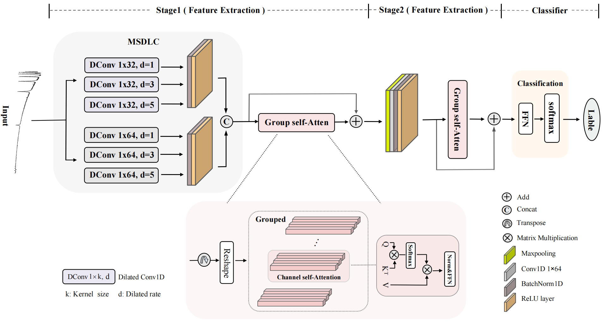

# Identification of Blue Straggler Stars Based on MultiScale Dilation and Attention Mechanisms

## 📄 BSS of Spectral Data Description 
The file of "bss_data.csv" contains stellar spectral data with information on the file name, classification labels, spectroscopic object ID, coordinates, signal-to-noise ratio, and cluster association.

##  **Column Description**
| **Column**      | **Unit**        | **Description**                                                                 |
|-----------------|-----------------|---------------------------------------------------------------------------------|
| `FileName`      | ---             | Spectrum file name (e.g., `spec-56982-HD000408N565515V01_sp04-010`)             |
| `label`         | ---             | Stellar classification label (`BSS`)                                        |
| `specObjID`     | ---             | Spectroscopic object ID                                                         |
| `ra`            | degrees         | Right Ascension (J2000)                                                         |
| `dec`           | degrees         | Declination (J2000)                                                             |
| `snMedian_g`    | ---             | Signal-to-noise ratio in the g-band                                             |
| `class`         | ---             | Stellar class (`STAR`)                                                          |
| `subclass`      | ---             | Stellar subclass (e.g., `A`, `B`)                                               |
| `resource`      | ---             | Spectrum source (`LAMOST` or `SDSS`)                                            |
| `paper`         | ---             | Reference paper                                                                 |
| `type`          | ---             | BSS type: `OC` , `GC` , or `field`  |
| `cluster_name`  | ---             | Name of the associated cluster                                                  |

##  **Notes**
- **type:**  
  - `OC`: BSS in Open Cluster  
  - `GC`: BSS in Globular Cluster  
  - `field`: Field BSS
- **paper**  
  - `rain_OC`: [J/A+A/650/A67](https://cdsarc.cds.unistra.fr/viz-bin/cat/J/A+A/650/A67)  
  - `Jadhav_OC`: [J/MNRAS/507/1699](https://cdsarc.cds.unistra.fr/viz-bin/cat/J/MNRAS/507/1699)  
  - `lcy_OC`: [J/A+A/672/A81](https://cdsarc.cds.unistra.fr/viz-bin/cat/J/A+A/672/A81)  
  - `hb_GC`: [J/MNRAS/462/3401](https://cdsarc.cds.unistra.fr/viz-bin/cat/J/MNRAS/462/3401)  
  - `Dalessandro E_2008`: [J/A+A/483/183](https://cdsarc.cds.unistra.fr/viz-bin/cat/J/A+A/483/183)  
  - `Xxx`: [J/ApJ/684/1143](https://cdsarc.cds.unistra.fr/viz-bin/cat/J/ApJ/684/1143)  

## 📄 MDA-Net

    
    
MDA_Net.py对应模型架构

